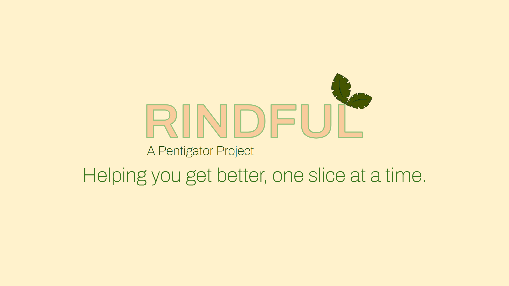
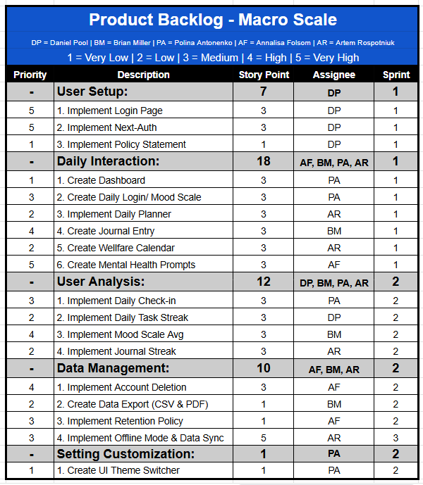

## BY: Pentigator
### Team Members & Roles: 
| Name              | Roles                          |
|-------------------|--------------------------------|
| Daniel Pool       | Developer, Product Manager     |
| Annalisa Folsom   | Developer, Documentation       |
| Brian Miller      | Developer, Designer            |
| Polina Antonenko  | Developer, Scrum Master        |
| Artem Rospotniuk  | Developer, Project Manager     |

## 🧐 Challenge
### To say mental health is among the most prevalent issues in today’s society would be an understatement. Per the NIH, nearly a quarter of all adults in the U.S. were reported to have some form of mental illness in 2022. With the rise of the internet, an increasingly abundant stream of information available at the average person’s fingertips, and its many adverse side-effects (political polarization, narrative siloing, and increased social atomization), maintaining one’s mental wellbeing can prove a significant challenge.

## ❤️ Solution
### RINDFUL allows users to daily journal and log their moods (using a citrus-inspired scale) in a safe environment. Users can view their mood progress by seeing graphical representations of how their mood changed over different time frames (hours, days, weeks, etc…). 
Plainly put: the goal of this app is to offer a lifeline to a prospective user, a space where they can focus their attention inward instead of outward, via earnest expression and reflection.

## 🌲CI/CD Process:
### - User Stories: https://docs.google.com/document/d/1U39HXU8xxEeSrgDvdAJMg62R5JpGGhb53SX98jX_PMM/edit?usp=sharing
### - Product Backlog: 


### - Software Architecture: https://docs.google.com/document/d/1cv_2az6fJBYb0nu5q9dhDKbhf7keUuS32aAUMqU2eHI/edit?usp=sharing
### 📓 Note: As a team, we also completed sprint retrospective 1, 2, Weekly Scrum Report, and Software Tests. The files to these will not be publicly available. 

## ⚡Quick Start
To install and tun this project locally, follow these steps:

### 🎨 Prerequisites 
- Node.js (version 18 or higher)
- npm or yarn or pnpm
  - Install Dependencies:
      ```npm install```
      ```yarn install```
      ```pnpm install```

### ⬇️ Installation Steps

1. Clone the repository:
```bash
git clone https://github.com/Daniel-Pool/RINDFUL.git
cd rindful
```

2. Install hugerte
```npm install @hugerte/hugerte-react```

3. Create a Firestore Account and get API Keys
   - 📓 Note: Make sure to select web app
    
4. Correctly place the corresponding API Key into the .env.local file

5. Enjoy!

### References

Google. (2025). *Manage users in Firebase*. Google. https://firebase.google.com/docs/auth/web/manage-users 

National Institute of Mental Health. “Mental Illness - National Institute of Mental Health (NIMH).” *National Institute of Mental Health*, https://www.nimh.nih.gov/health/statistics/mental-illness. Accessed 20 September 2025.

https://www.youtube.com/watch?v=S_sV6bYWKXQ  


